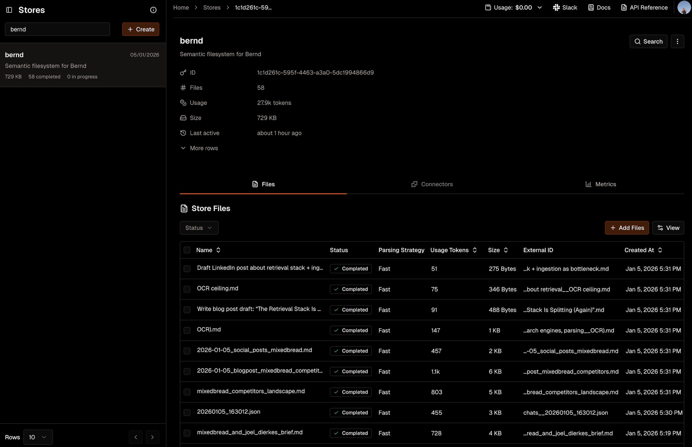

<div align="center">
  <a href="https://github.com/mixedbread-ai/bernd">
    
  </a>
  <h1>Bernd</h1>
  <p><em>An AI chief of staff with transparent, persistent, searchable memory. Built with Repspone API + Mixedbread.</em></p>
  <a href="https://opensource.org/licenses/MIT"></a>
  <a href="https://bernd.mixedbread.com"></a>
  <a href="https://join.slack.com/t/mixedbreadcommunity/shared_invite/zt-3kagj5m36-wwM_hryIFby7B2wlcOaHaQ"></a>
</div>

<br>

## What Is Bernd

Bernd is an AI assistant that remembers everything you tell it — and lets you see exactly what it knows.

Most AI assistants are stateless, they forget everything between sessions. Bernd uses Mixedbread to give your AI persistent, searchable memory by treating Mixedbread as a filesystem with extremely smart search. Ask "what was that project with Sarah?" and it finds the right context based on previous information and conversation.

Unlike AI agents with opaque memory systems, everything Bernd knows is stored in your Mixedbread store. Browse it, search it, edit it, or delete it anytime through the [Mixedbread dashboard](https://mixedbread.com). Full visibility and control.

<p align="center">
  
  <br>
  <em>Bernd's memory in the Mixedbread dashboard</em>
</p>

### What is Mixedbread

[Mixedbread](https://mixedbread.com) is a multilingual semantic search API for your data, upload [any file](https://www.mixedbread.com/docs/stores/ingest/file-types) (text, PDFs, images, slides, code, audio, video) and Mixedbread automatically indexes it, making it searchable by meaning.

## How It Works

We treat a Mixedbread store like a filesystem, file paths become `external_id`s, and every file is searchable.

```
/todos/                     # Todo items
/memories/user.md           # User profile (auto-loaded into system prompt)
/memories/people/           # Contacts and relationships
/notes/                     # User notes
/chats/                     # Conversation history
```

| File | What it does |
|------|--------------|
| [`backend/tools/semantic_fs.py`](backend/tools/semantic_fs.py) | SemanticFS class — the core abstraction (~200 lines) |
| [`backend/agent/tools.py`](backend/agent/tools.py) | OpenAI function schemas |
| [`backend/agent/handlers.py`](backend/agent/handlers.py) | Tool implementations |
| [`backend/agent/core.py`](backend/agent/core.py) | Agent loop for tool-calling |

## Quick Start

### Prerequisites

- Python 3.12+
- [uv](https://github.com/astral-sh/uv)
- [Bun](https://bun.sh) (for frontend)
- [OpenAI API key](https://platform.openai.com)
- [Mixedbread account](https://mixedbread.com) (free)
- Google Cloud OAuth credentials (optional, for calendar)

### Installation

```bash
git clone https://github.com/mixedbread-ai/bernd.git
cd bernd

# Python dependencies
uv sync

# Frontend dependencies
cd ui && bun install && cd ..
```

### Configuration

```bash
cp .env.example .env
```

Edit `.env`:

```
OPENAI_API_KEY=your-openai-key

# Optional: Google Calendar
GOOGLE_REDIRECT_URI=http://localhost:8000/auth/google/callback
```

### Running

**CLI:**

```bash
uv run agent.py
```

**Web UI:**

```bash
# Terminal 1: API server
uv run uvicorn backend.main:app --reload

# Terminal 2: Frontend
cd ui && bun run dev
```

Open [http://localhost:3000](http://localhost:3000) and sign in with your Mixedbread account.

## Tools

| Tool | Description |
|------|-------------|
| `todos` | Add, list, search, update, remove (syncs to calendar) |
| `memory` | Store, retrieve, and search memories |
| `files` | Semantic filesystem access |
| `calendar` | Google Calendar integration |
| `web_search` | Search the web |
| `fetch` | Extract content from URLs |

## Built With

- [OpenAI](https://openai.com) — GPT with Responses API
- [Mixedbread](https://mixedbread.com) — Semantic storage and search
- [FastAPI](https://fastapi.tiangolo.com) — Python backend
- [Next.js](https://nextjs.org) — React frontend

## License

MIT
